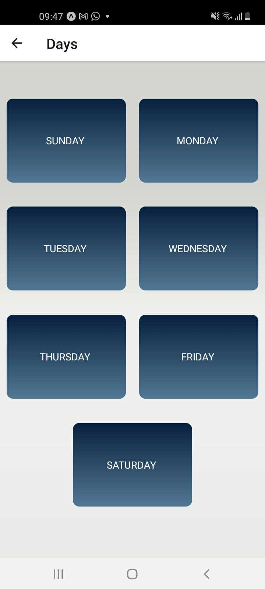
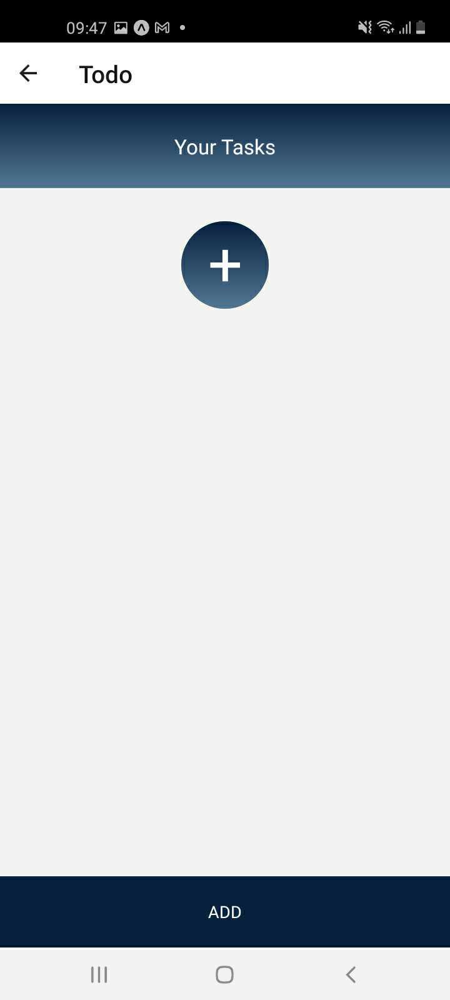
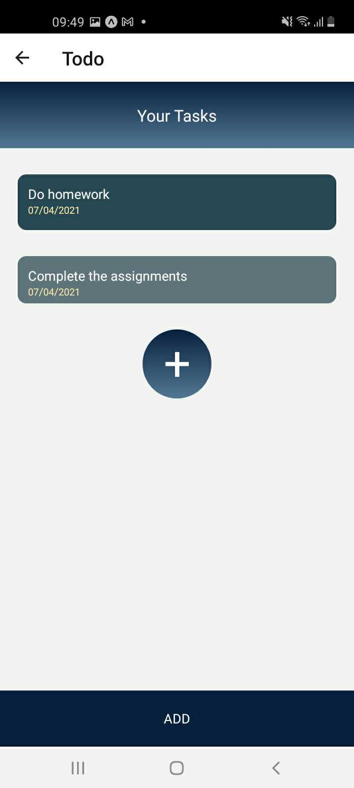

# AwesomeTodo

+ Phone App was made by react native
+ It is a simple notes app to keep your notes in and avoid losing your mind

# Authors
* [Qais Waleed](https://github.com/qaisw96) , [Ghofran Dayyat](https://github.com/ghofranDayyat/) , [zakeyah](https://github.com/zakeyah)

# Links
* [GitHub](https://github.com/zakeyah/AwesomeTodo)

# Technology and Tools
* React Native
* [Expo](https://m.apkpure.com/ar/expo/host.exp.exponent) 

# Running
* ``npm install --global expo-cli``
* `npm i `
* `expo start`

## Days Page 

## Tasks Page 

